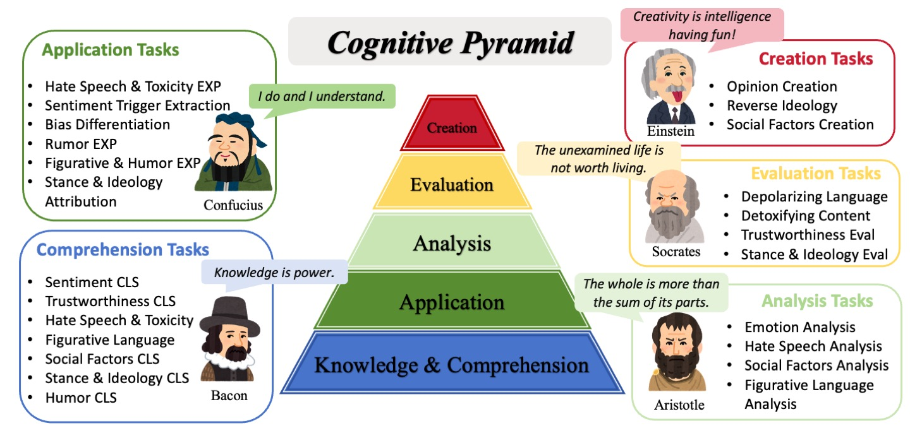
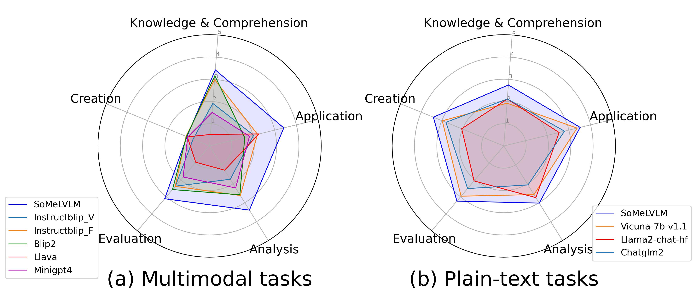
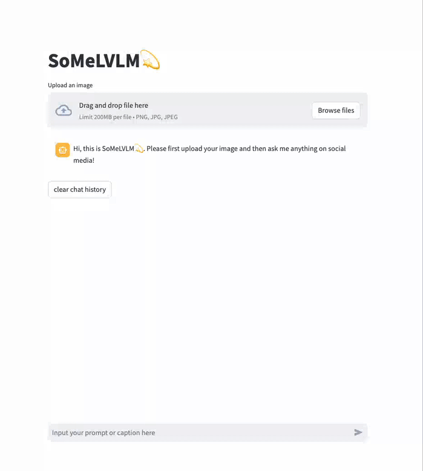
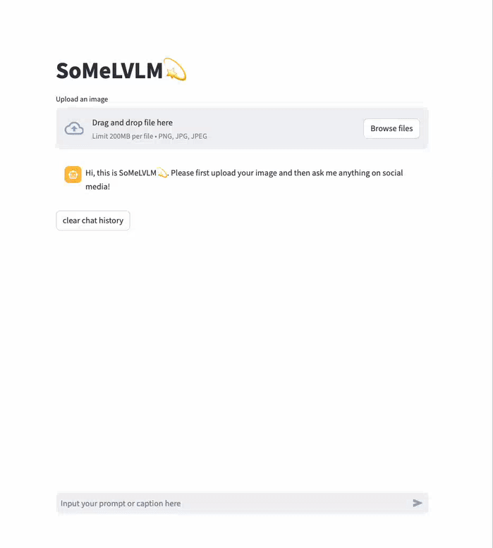
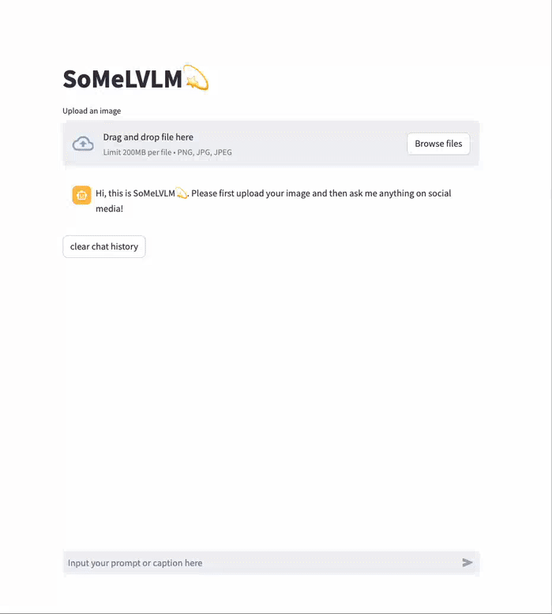

# SoMeLVLM: A Large Vision Language Model for Social Media Processing

This is the repository for the preprint paper: [SoMeLVLM: A Large Vision Language Model for Social Media Processing](https://arxiv.org/abs/2402.13022). [Xinnong Zhang\*](https://lishi905.github.io), [Haoyu Kuang\*](https://haoyuk.github.io)

More Resources can be found on [SoMeLVLM HomePage](https://somelvlm.github.io).

**🎉🎉🎉\[News 20240516\] SoMeLVLM has been accepted to ACL 2024 Findings💫**



## Datasets & Model Weights

Model weights: [Lishi0905/SoMeLVLM · Hugging Face](https://huggingface.co/Lishi0905/SoMeLVLM)

Plain text & Multimodal datasets: [Request Form](https://forms.gle/h4UCzUxPCE3pjo9e9)

## Table of Contents

- [Abstract](#Abstract)
- [Datasets](#Datasets)
- [Experiment Results](#Experiment-Results)
- [Reproduction](#Reproduction)
- [Ethics Statement](#Ethics-Statement)
- [Citation](#Citation)

## Abstract

The growth of social media, characterized by its multimodal nature, has led to the emergence of diverse phenomena and challenges, which calls for an effective approach to uniformly solve automated tasks. The powerful Large Vision Language Models make it possible to handle a variety of tasks simultaneously, but even with carefully designed prompting methods, the general domain models often fall short in aligning with the unique speaking style and context of social media tasks. In this paper, we introduce **a Large Vision Language Model for Social Media Processing (SoMeLVLM)**, which is a cognitive framework equipped with five key capabilities including **knowledge & comprehension**, **application**, **analysis**, **evaluation**, and **creation**. SoMeLVLM is designed to understand and generate realistic social media behavior. We have developed a 654k multimodal social media instruction-tuning dataset to support our cognitive framework and fine-tune our model. Our experiments demonstrate that SoMeLVLM achieves **state-of-the-art** performance in multiple social media tasks. Further analysis shows its significant advantages over baselines in terms of cognitive abilities.

## Datasets

We have developed a **654k** social media dataset **SoMeData**, which consists of five cognitive modules and various CSS task categories.


<table class="tg">
<thead>
  <tr>
    <th class="tg-nrix">Module</th>
    <th class="tg-nrix">Category</th>
    <th class="tg-nrix">DataSize(SFT &amp; Eval)</th>
    <th class="tg-nrix">Data Type</th>
  </tr>
</thead>
<tbody>
  <tr>
    <td class="tg-nrix" rowspan="13">Knowledge &amp; Comprehension</td>
    <td class="tg-nrix" rowspan="2">Emotion</td>
    <td class="tg-nrix">45.0k &amp; 5.0k</td>
    <td class="tg-nrix">Text</td>
  </tr>
  <tr>
    <td class="tg-nrix">20.3k &amp; 1.5k</td>
    <td class="tg-nrix">Multi</td>
  </tr>
  <tr>
    <td class="tg-nrix">Humor</td>
    <td class="tg-nrix">18.0k &amp; 8.3k</td>
    <td class="tg-nrix">Text</td>
  </tr>
  <tr>
    <td class="tg-nrix">Figurative Language</td>
    <td class="tg-nrix"><span style="color:#000">12.5k &amp; 4.6k</span></td>
    <td class="tg-nrix">Text</td>
  </tr>
  <tr>
    <td class="tg-nrix" rowspan="2">Misinformation</td>
    <td class="tg-nrix">24.4k &amp; 2.0k</td>
    <td class="tg-nrix">Text</td>
  </tr>
  <tr>
    <td class="tg-nrix"><span style="color:#000">6.5k &amp; 0.5k</span></td>
    <td class="tg-nrix">Multi</td>
  </tr>
  <tr>
    <td class="tg-nrix" rowspan="2">Hate Speech &amp; Toxicity</td>
    <td class="tg-nrix">44.1k &amp; 6.3k</td>
    <td class="tg-nrix">Text</td>
  </tr>
  <tr>
    <td class="tg-nrix">13.8k &amp; 1.4k</td>
    <td class="tg-nrix">Multi</td>
  </tr>
  <tr>
    <td class="tg-nrix" rowspan="2">Ideology &amp; Stance</td>
    <td class="tg-nrix">24.0k &amp; 3.5k</td>
    <td class="tg-nrix">Text</td>
  </tr>
  <tr>
    <td class="tg-nrix">1.6k &amp; 0.3k</td>
    <td class="tg-nrix">Multi</td>
  </tr>
  <tr>
    <td class="tg-nrix">Truthworthiness &amp; Social Bias</td>
    <td class="tg-nrix">11.0k &amp; 3.2k</td>
    <td class="tg-nrix">Text</td>
  </tr>
  <tr>
    <td class="tg-nrix" rowspan="2">Social_factors</td>
    <td class="tg-nrix">16.2k &amp; 2.5k</td>
    <td class="tg-nrix">Text</td>
  </tr>
  <tr>
    <td class="tg-nrix">40.0k &amp; 1.0k</td>
    <td class="tg-nrix">Multi</td>
  </tr>
  <tr>
    <td class="tg-nrix" rowspan="6">Applying</td>
    <td class="tg-nrix">Emotion</td>
    <td class="tg-nrix"><span style="color:#000">20.0k &amp; 5.0k</span></td>
    <td class="tg-nrix">Text</td>
  </tr>
  <tr>
    <td class="tg-nrix">Humor</td>
    <td class="tg-nrix">15.0k &amp; 6.1k</td>
    <td class="tg-nrix">Text</td>
  </tr>
  <tr>
    <td class="tg-nrix"><span style="color:#000">Hate Speech &amp; Toxicity</span></td>
    <td class="tg-nrix">29.6k &amp; 16.2k</td>
    <td class="tg-nrix"><span style="color:#000">Text</span></td>
  </tr>
  <tr>
    <td class="tg-nrix">Ideology &amp; Stance</td>
    <td class="tg-nrix">4.3k &amp; 1.0k</td>
    <td class="tg-nrix">Text</td>
  </tr>
  <tr>
    <td class="tg-nrix"><span style="color:#000">Truthworthiness &amp; Social Bias</span></td>
    <td class="tg-nrix">30.0k &amp; 0.9k</td>
    <td class="tg-nrix">Text</td>
  </tr>
  <tr>
    <td class="tg-nrix">Social_factors</td>
    <td class="tg-nrix">50.0k &amp; 1.0k</td>
    <td class="tg-nrix">Multi</td>
  </tr>
  <tr>
    <td class="tg-nrix" rowspan="4">Analysis</td>
    <td class="tg-nrix">Figurative Language</td>
    <td class="tg-nrix">30.0k &amp; 2.2k</td>
    <td class="tg-nrix">Text</td>
  </tr>
  <tr>
    <td class="tg-nrix">Emotion</td>
    <td class="tg-nrix">20.3k &amp; 1.5k</td>
    <td class="tg-nrix">Multi</td>
  </tr>
  <tr>
    <td class="tg-nrix"><span style="color:#000">Hate Speech &amp; Toxicity</span></td>
    <td class="tg-nrix">13.8k &amp; 1.5k</td>
    <td class="tg-nrix">Multi</td>
  </tr>
  <tr>
    <td class="tg-nrix">Social_factors</td>
    <td class="tg-nrix">15.0k &amp; 0.5k</td>
    <td class="tg-nrix">Multi</td>
  </tr>
  <tr>
    <td class="tg-nrix" rowspan="5">Evaluation</td>
    <td class="tg-nrix">Ideology &amp; Stance</td>
    <td class="tg-nrix">1.6k &amp; 0.3k</td>
    <td class="tg-nrix">Multi</td>
  </tr>
  <tr>
    <td class="tg-nrix" rowspan="2"><span style="color:#000">Misinformation</span></td>
    <td class="tg-nrix">2.0k &amp; 0.0k</td>
    <td class="tg-nrix">Text</td>
  </tr>
  <tr>
    <td class="tg-nrix">6.5k &amp; 0.5k</td>
    <td class="tg-nrix">Multi</td>
  </tr>
  <tr>
    <td class="tg-nrix">Detoxifying Content</td>
    <td class="tg-nrix">25.0k &amp; 9.9k</td>
    <td class="tg-nrix">Text</td>
  </tr>
  <tr>
    <td class="tg-nrix">Depolarizing Language</td>
    <td class="tg-nrix">4.3k &amp; 1.0k</td>
    <td class="tg-nrix">Text</td>
  </tr>
  <tr>
    <td class="tg-nrix" rowspan="3">Creation</td>
    <td class="tg-nrix">Invert Opinion</td>
    <td class="tg-nrix">1.0k &amp; 0.0k</td>
    <td class="tg-nrix">Text</td>
  </tr>
  <tr>
    <td class="tg-nrix">Reverse ideology</td>
    <td class="tg-nrix">4.3k &amp; 1.0k</td>
    <td class="tg-nrix">Text</td>
  </tr>
  <tr>
    <td class="tg-nrix">Social_factors</td>
    <td class="tg-nrix">25k &amp; 0.5k</td>
    <td class="tg-nrix">Multi</td>
  </tr>
</tbody>
</table>

## Experiment Results

We conduct both **classification task** and **generation task** on both **plain text domain** and **multimodal domain**.

### Multimodal results

Classification tasks


<table class="tg">
<thead>
  <tr>
    <th class="tg-c3ow" rowspan="2">Models</th>
    <th class="tg-c3ow" colspan="2"><span style="color:#000">Hate </span><br><span style="color:#000">Speech</span></th>
    <th class="tg-c3ow" colspan="2"><span style="color:#000">Misinformation</span></th>
    <th class="tg-c3ow" colspan="2"><span style="color:#000">Social </span><br><span style="color:#000">Factors</span></th>
    <th class="tg-c3ow" colspan="2"><span style="color:#000">Emotion</span></th>
    <th class="tg-c3ow" colspan="2"><span style="color:#000">Ideology</span></th>
    <th class="tg-c3ow" colspan="2"><span style="color:#000">Social Factors </span><br><span style="color:#000">OOD</span></th>
  </tr>
  <tr>
    <th class="tg-c3ow"><span style="color:#000">Acc*</span></th>
    <th class="tg-c3ow"><span style="color:#000">Acc</span></th>
    <th class="tg-c3ow"><span style="color:#000">Acc*</span></th>
    <th class="tg-c3ow"><span style="color:#000">Acc</span></th>
    <th class="tg-c3ow"><span style="color:#000">Acc*</span></th>
    <th class="tg-c3ow"><span style="color:#000">Acc</span></th>
    <th class="tg-c3ow"><span style="color:#000">Acc*</span></th>
    <th class="tg-c3ow"><span style="color:#000">Acc</span></th>
    <th class="tg-c3ow"><span style="color:#000">Acc*</span></th>
    <th class="tg-c3ow"><span style="color:#000">Acc</span></th>
    <th class="tg-c3ow"><span style="color:#000">Acc*</span></th>
    <th class="tg-c3ow"><span style="color:#000">Acc</span></th>
  </tr>
</thead>
<tbody>
  <tr>
    <td class="tg-0pky"><span style="color:#000">Instructblip_V</span></td>
    <td class="tg-c3ow"><span style="color:#000">41.62</span></td>
    <td class="tg-c3ow"><span style="color:#000">33.43</span></td>
    <td class="tg-c3ow"><span style="color:#000">47.55</span></td>
    <td class="tg-c3ow"><span style="color:#000">13.60</span></td>
    <td class="tg-c3ow"><span style="color:#000">80.02</span></td>
    <td class="tg-c3ow"><span style="color:#000">40.93</span></td>
    <td class="tg-c3ow"><span style="color:#000">54.53</span></td>
    <td class="tg-c3ow"><span style="color:#000">48.90</span></td>
    <td class="tg-c3ow"><span style="color:#000">54.15</span></td>
    <td class="tg-c3ow"><span style="color:#000">42.41</span></td>
    <td class="tg-c3ow"><span style="color:#000">87.30</span></td>
    <td class="tg-c3ow"><span style="color:#000">22.59</span></td>
  </tr>
  <tr>
    <td class="tg-0pky"><span style="color:#000">Instructblip_F</span></td>
    <td class="tg-c3ow"><span style="color:#000">50.40</span></td>
    <td class="tg-c3ow"><span style="color:#000">48.43</span></td>
    <td class="tg-c3ow"><span style="color:#000">80.78</span></td>
    <td class="tg-c3ow"><span style="color:#000">79.00</span></td>
    <td class="tg-c3ow"><span style="color:#000">81.33</span></td>
    <td class="tg-zw5y"><span style="text-decoration:underline;color:#000">73.57</span></td>
    <td class="tg-zw5y"><span style="text-decoration:underline;color:#000">58.90</span></td>
    <td class="tg-zw5y"><span style="text-decoration:underline;color:#000">57.80</span></td>
    <td class="tg-zw5y"><span style="text-decoration:underline;color:#000">53.69</span></td>
    <td class="tg-c3ow"><span style="color:#000">45.57</span></td>
    <td class="tg-c3ow"><span style="color:#000">98.31</span></td>
    <td class="tg-zw5y"><span style="text-decoration:underline;color:#000">83.95</span></td>
  </tr>
  <tr>
    <td class="tg-0pky"><span style="color:#000">Blip2</span></td>
    <td class="tg-c3ow"><span style="color:#000">52.14</span></td>
    <td class="tg-zw5y"><span style="text-decoration:underline;color:#000">52.14</span></td>
    <td class="tg-c3ow"><span style="color:#000">80.60</span></td>
    <td class="tg-zw5y"><span style="text-decoration:underline;color:#000">80.60</span></td>
    <td class="tg-zw5y"><span style="text-decoration:underline;color:#000">81.83</span></td>
    <th class="tg-7btt"><span style="font-weight:bold;color:#000">80.89</span></th>
    <td class="tg-c3ow"><span style="color:#000">57.73</span></td>
    <td class="tg-c3ow"><span style="color:#000">57.73</span></td>
    <td class="tg-c3ow"><span style="color:#000">53.48</span></td>
    <td class="tg-zw5y"><span style="text-decoration:underline;color:#000">53.48</span></td>
    <td class="tg-zw5y"><span style="text-decoration:underline;color:#000">99.15</span></td>
    <th class="tg-7btt"><span style="font-weight:bold;color:#000">95.69</span></th>
  </tr>
  <tr>
    <td class="tg-0pky"><span style="color:#000">Llava</span></td>
    <td class="tg-zw5y"><span style="text-decoration:underline;color:#000">53.35</span></td>
    <td class="tg-c3ow"><span style="color:#000">9.79</span></td>
    <th class="tg-7btt"><span style="font-weight:bold;color:#000">84.67</span></th>
    <td class="tg-c3ow"><span style="color:#000">25.40</span></td>
    <td class="tg-c3ow"><span style="color:#000">72.49</span></td>
    <td class="tg-c3ow"><span style="color:#000">6.69</span></td>
    <td class="tg-c3ow"><span style="color:#000">53.39</span></td>
    <td class="tg-c3ow"><span style="color:#000">10.10</span></td>
    <td class="tg-c3ow"><span style="color:#000">49.79</span></td>
    <td class="tg-c3ow"><span style="color:#000">1.58</span></td>
    <td class="tg-c3ow"><span style="color:#000">93.75</span></td>
    <td class="tg-c3ow"><span style="color:#000">3.08</span></td>
  </tr>
  <tr>
    <td class="tg-0pky"><span style="color:#000">MiniGPT4</span></td>
    <td class="tg-c3ow"><span style="color:#000">45.12</span></td>
    <td class="tg-c3ow"><span style="color:#000">23.00</span></td>
    <td class="tg-c3ow"><span style="color:#000">65.30</span></td>
    <td class="tg-c3ow"><span style="color:#000">54.20</span></td>
    <td class="tg-c3ow"><span style="color:#000">64.08</span></td>
    <td class="tg-c3ow"><span style="color:#000">36.18</span></td>
    <td class="tg-c3ow"><span style="color:#000">53.13</span></td>
    <td class="tg-c3ow"><span style="color:#000">29.48</span></td>
    <td class="tg-c3ow"><span style="color:#000">42.13</span></td>
    <td class="tg-c3ow"><span style="color:#000">8.86</span></td>
    <td class="tg-c3ow"><span style="color:#000">69.58</span></td>
    <td class="tg-c3ow"><span style="color:#000">34.29</span></td>
  </tr>
  <tr>
    <td class="tg-0pky"><span style="color:#000">SoMeLVLM</span></td>
    <th class="tg-7btt"><span style="font-weight:bold;color:#000">72.57</span></th>
    <th class="tg-7btt"><span style="color:#000">72.57</span></th>
    <td class="tg-zw5y"><span style="text-decoration:underline;color:#000">82.60</span></td>
    <th class="tg-7btt"><span style="font-weight:bold;color:#000">82.60</span></th>
    <th class="tg-7btt"><span style="font-weight:bold;color:#000">84.07</span></th>
    <td class="tg-c3ow"><span style="color:#000">67.33</span></td>
    <th class="tg-7btt"><span style="font-weight:bold;color:#000">63.50</span></th>
    <th class="tg-7btt"><span style="font-weight:bold;color:#000">63.47</span></th>
    <th class="tg-7btt"><span style="font-weight:bold;color:#000">73.24</span></th>
    <th class="tg-7btt"><span style="font-weight:bold;color:#000">55.06</span></th>
    <th class="tg-7btt"><span style="font-weight:bold;color:#000">100.00</span></th>
    <td class="tg-c3ow"><span style="color:#000">61.11</span></td>
  </tr>
</tbody>
</table>

Generation tasks

<table class="tg">
<thead>
  <tr>
    <th class="tg-lboi"><span style="color:#000">Models</span></th>
    <th class="tg-lboi"><span style="color:#000">Metrics</span></th>
    <th class="tg-9wq8"><span style="color:#000">Hate Speech</span></th>
    <th class="tg-9wq8"><span style="color:#000">Misinfor- </br> mation</span></th>
    <th class="tg-9wq8"><span style="color:#000">Social Factors</span></th>
    <th class="tg-9wq8"><span style="color:#000">Emotion</span></th>
    <th class="tg-9wq8"><span style="color:#000">Ideology</span></th>
    <th class="tg-9wq8"><span style="color:#000">Social Factors OOD</span></th>
  </tr>
</thead>
<tbody>
  <tr>
    <td class="tg-lboi" rowspan="3"><span style="color:#000">Instructblip_V</span></td>
    <td class="tg-lboi"><span style="color:#000">BLEU</span></td>
    <td class="tg-9w52"><span style="text-decoration:underline;color:#000">0.65</span></td>
    <td class="tg-9w52"><span style="text-decoration:underline;color:#000">1.09</span></td>
    <td class="tg-9w52"><span style="text-decoration:underline;color:#000">6.21</span></td>
    <td class="tg-9w52"><span style="text-decoration:underline;color:#000">0.85</span></td>
    <td class="tg-9wq8"><span style="color:#000">0.60</span></td>
    <td class="tg-9wq8"><span style="color:#000">1.14</span></td>
  </tr>
  <tr>
    <td class="tg-lboi"><span style="color:#000">ROUGE</span></td>
    <td class="tg-9wq8"><span style="color:#000">3.13</span></td>
    <td class="tg-9wq8"><span style="color:#000">0.88</span></td>
    <td class="tg-9wq8"><span style="color:#000">9.02</span></td>
    <td class="tg-9wq8"><span style="color:#000">7.26</span></td>
    <td class="tg-9wq8"><span style="color:#000">4.89</span></td>
    <td class="tg-9wq8"><span style="color:#000">14.03</span></td>
  </tr>
  <tr>
    <td class="tg-lboi"><span style="color:#000">GPT</span></td>
    <td class="tg-9wq8"><span style="color:#000">1.83</span></td>
    <td class="tg-9wq8"><span style="color:#000">2.84</span></td>
    <td class="tg-9wq8"><span style="color:#000">1.46</span></td>
    <td class="tg-9wq8"><span style="color:#000">1.96</span></td>
    <td class="tg-9wq8"><span style="color:#000">1.61</span></td>
    <td class="tg-9wq8"><span style="color:#000">2.07</span></td>
  </tr>
  <tr>
    <td class="tg-lboi" rowspan="3"><span style="color:#000">Instructblip_F</span></td>
    <td class="tg-lboi"><span style="color:#000">BLEU</span></td>
    <td class="tg-9wq8"><span style="color:#000">0.24</span></td>
    <td class="tg-9wq8"><span style="color:#000">0.05</span></td>
    <td class="tg-9wq8"><span style="color:#000">1.16</span></td>
    <td class="tg-9wq8"><span style="color:#000">0.28</span></td>
    <td class="tg-9wq8"><span style="color:#000">0.78</span></td>
    <td class="tg-9wq8"><span style="color:#000">1.51</span></td>
  </tr>
  <tr>
    <td class="tg-lboi"><span style="color:#000">ROUGE</span></td>
    <td class="tg-9wq8"><span style="color:#000">2.79</span></td>
    <td class="tg-9wq8"><span style="color:#000">0.81</span></td>
    <td class="tg-9wq8"><span style="color:#000">14.60</span></td>
    <td class="tg-9wq8"><span style="color:#000">13.69</span></td>
    <td class="tg-9wq8"><span style="color:#000">8.36</span></td>
    <td class="tg-9wq8"><span style="color:#000">16.91</span></td>
  </tr>
  <tr>
    <td class="tg-lboi"><span style="color:#000">GPT</span></td>
    <td class="tg-9wq8"><span style="color:#000">2.11</span></td>
    <td class="tg-9w52"><span style="text-decoration:underline;color:#000">2.85</span></td>
    <td class="tg-9w52"><span style="text-decoration:underline;color:#000">2.12</span></td>
    <td class="tg-9wq8"><span style="color:#000">3.02</span></td>
    <td class="tg-9wq8"><span style="color:#000">1.62</span></td>
    <td class="tg-9wq8"><span style="color:#000">2.16</span></td>
  </tr>
  <tr>
    <td class="tg-lboi" rowspan="3"><span style="color:#000">Blip2</span></td>
    <td class="tg-lboi"><span style="color:#000">BLEU</span></td>
    <td class="tg-9wq8"><span style="color:#000">0.62</span></td>
    <td class="tg-9wq8"><span style="color:#000">0.02</span></td>
    <td class="tg-9wq8"><span style="color:#000">0.76</span></td>
    <td class="tg-9wq8"><span style="color:#000">0.16</span></td>
    <td class="tg-9wq8"><span style="color:#000">0.25</span></td>
    <td class="tg-9wq8"><span style="color:#000">0.65</span></td>
  </tr>
  <tr>
    <td class="tg-lboi"><span style="color:#000">ROUGE</span></td>
    <td class="tg-9wq8"><span style="color:#000">2.25</span></td>
    <td class="tg-9wq8"><span style="color:#000">1.89</span></td>
    <td class="tg-9wq8"><span style="color:#000">11.99</span></td>
    <td class="tg-9w52"><span style="text-decoration:underline;color:#000">14.82</span></td>
    <td class="tg-9wq8"><span style="color:#000">4.35</span></td>
    <td class="tg-9wq8"><span style="color:#000">12.87</span></td>
  </tr>
  <tr>
    <td class="tg-lboi"><span style="color:#000">GPT</span></td>
    <td class="tg-9wq8"><span style="color:#000">1.86</span></td>
    <td class="tg-9wq8"><span style="color:#000">2.72</span></td>
    <td class="tg-9wq8"><span style="color:#000">1.89</span></td>
    <td class="tg-9w52"><span style="text-decoration:underline;color:#000">3.08</span></td>
    <td class="tg-9w52"><span style="text-decoration:underline;color:#000">2.34</span></td>
    <td class="tg-9wq8"><span style="color:#000">1.61</span></td>
  </tr>
  <tr>
    <td class="tg-lboi" rowspan="3"><span style="color:#000">Llava</span></td>
    <td class="tg-lboi"><span style="color:#000">BLEU</span></td>
    <td class="tg-9wq8"><span style="color:#000">0.36</span></td>
    <td class="tg-9wq8"><span style="color:#000">0.00</span></td>
    <td class="tg-9wq8"><span style="color:#000">1.89</span></td>
    <td class="tg-9wq8"><span style="color:#000">0.64</span></td>
    <td class="tg-9w52"><span style="text-decoration:underline;color:#000">1.10</span></td>
    <td class="tg-9w52"><span style="text-decoration:underline;color:#000">2.29</span></td>
  </tr>
  <tr>
    <td class="tg-lboi"><span style="color:#000">ROUGE</span></td>
    <td class="tg-9wq8"><span style="color:#000">4.52</span></td>
    <td class="tg-9wq8"><span style="color:#000">0.01</span></td>
    <td class="tg-9wq8"><span style="color:#000">12.80</span></td>
    <td class="tg-9wq8"><span style="color:#000">5.74</span></td>
    <td class="tg-9wq8"><span style="color:#000">8.73</span></td>
    <td class="tg-9wq8"><span style="color:#000">20.10</span></td>
  </tr>
  <tr>
    <td class="tg-lboi"><span style="color:#000">GPT</span></td>
    <td class="tg-9wq8"><span style="color:#000">1.23</span></td>
    <td class="tg-9wq8"><span style="color:#000">0.81</span></td>
    <td class="tg-9wq8"><span style="color:#000">1.80</span></td>
    <td class="tg-9wq8"><span style="color:#000">1.25</span></td>
    <td class="tg-9wq8"><span style="color:#000">1.21</span></td>
    <td class="tg-9w52"><span style="text-decoration:underline;color:#000">2.27</span></td>
  </tr>
  <tr>
    <td class="tg-lboi" rowspan="3"><span style="color:#000">Minigpt4</span></td>
    <td class="tg-lboi"><span style="color:#000">BLEU</span></td>
    <td class="tg-9wq8"><span style="color:#000">0.43</span></td>
    <td class="tg-9wq8"><span style="color:#000">0.69</span></td>
    <td class="tg-9wq8"><span style="color:#000">1.20</span></td>
    <td class="tg-9wq8"><span style="color:#000">0.55</span></td>
    <td class="tg-9wq8"><span style="color:#000">0.32</span></td>
    <td class="tg-9wq8"><span style="color:#000">1.98</span></td>
  </tr>
  <tr>
    <td class="tg-lboi"><span style="color:#000">ROUGE</span></td>
    <td class="tg-9w52"><span style="text-decoration:underline;color:#000">8.84</span></td>
    <td class="tg-9w52"><span style="text-decoration:underline;color:#000">12.15</span></td>
    <td class="tg-9w52"><span style="text-decoration:underline;color:#000">17.20</span></td>
    <td class="tg-9wq8"><span style="color:#000">10.81</span></td>
    <td class="tg-9w52"><span style="text-decoration:underline;color:#000">12.68</span></td>
    <td class="tg-9w52"><span style="text-decoration:underline;color:#000">20.73</span></td>
  </tr>
  <tr>
    <td class="tg-lboi"><span style="color:#000">GPT</span></td>
    <td class="tg-9w52"><span style="text-decoration:underline;color:#000">2.28</span></td>
    <td class="tg-9wq8"><span style="color:#000">2.18</span></td>
    <td class="tg-9wq8"><span style="color:#000">1.59</span></td>
    <td class="tg-9wq8"><span style="color:#000">2.37</span></td>
    <td class="tg-9wq8"><span style="color:#000">1.28</span></td>
    <td class="tg-9wq8"><span style="color:#000">1.84</span></td>
  </tr>
  <tr>
    <td class="tg-lboi" rowspan="3"><span style="color:#000">SoMeLVLM</span></td>
    <td class="tg-lboi"><span style="color:#000">BLEU</span></td>
    <th class="tg-uzvj"><span style="font-weight:bold;color:#000">31.04</span></th>
    <th class="tg-uzvj"><span style="font-weight:bold;color:#000">24.06</span></th>
    <th class="tg-uzvj"><span style="font-weight:bold;color:#000">14.49</span></th>
    <th class="tg-uzvj"><span style="font-weight:bold;color:#000">37.65</span></th>
    <th class="tg-uzvj"><span style="font-weight:bold;color:#000">24.08</span></th>
    <th class="tg-uzvj"><span style="font-weight:bold;color:#000">10.18</span></th>
  </tr>
  <tr>
    <td class="tg-lboi"><span style="color:#000">ROUGE</span></td>
    <th class="tg-uzvj"><span style="font-weight:bold;color:#000">46.35</span></th>
    <th class="tg-uzvj"><span style="font-weight:bold;color:#000">43.22</span></th>
    <th class="tg-uzvj"><span style="font-weight:bold;color:#000">32.87</span></th>
    <th class="tg-uzvj"><span style="font-weight:bold;color:#000">53.87</span></th>
    <th class="tg-uzvj"><span style="font-weight:bold;color:#000">41.04</span></th>
    <th class="tg-uzvj"><span style="font-weight:bold;color:#000">31.03</span></th>
  </tr>
  <tr>
    <td class="tg-lboi"><span style="color:#000">GPT</span></td>
    <th class="tg-uzvj"><span style="font-weight:bold;color:#000">3.21</span></th>
    <th class="tg-uzvj"><span style="font-weight:bold;color:#000">2.94</span></th>
    <th class="tg-uzvj"><span style="font-weight:bold;color:#000">2.86</span></th>
    <th class="tg-uzvj"><span style="font-weight:bold;color:#000">3.53</span></th>
    <th class="tg-uzvj"><span style="font-weight:bold;color:#000">3.39</span></th>
    <th class="tg-uzvj"><span style="font-weight:bold;color:#000">3.45</span></th>
  </tr>
</tbody>
</table>

### Plain text results

Classification tasks


<table class="tg">
<thead>
  <tr>
    <th class="tg-nrix"><span style="color:#000">Models</span></th>
    <th class="tg-xd54"><span style="color:#1F2329">Emotion</span></th>
    <th class="tg-xd54"><span style="color:#1F2329">Humor</span></th>
    <th class="tg-xd54"><span style="color:#1F2329">Figurative </span><br><span style="color:#1F2329">Language</span></th>
    <th class="tg-xd54"><span style="color:#1F2329">Misinfor-</span><br><span style="color:#1F2329">mation</span></th>
    <th class="tg-xd54">Hate<br>Speech</th>
    <th class="tg-xd54"><span style="color:#1F2329">Ideology</span></th>
    <th class="tg-0p15"><span style="color:#1F2329">Trustworthi-</span><br><span style="color:#1F2329">ness</span></th>
    <th class="tg-xd54"><span style="color:#1F2329">Social </span><br><span style="color:#1F2329">Factors</span></th>
  </tr>
</thead>
<tbody>
  <tr>
    <td class="tg-cly1"><span style="color:#000">Vicuna-7b-v1.1</span></td>
    <td class="tg-nrix">35.86</td>
    <td class="tg-nrix">41.08</td>
    <td class="tg-nrix">47.07</td>
    <td class="tg-8b8f"><span style="text-decoration:underline">59.23</span></td>
    <td class="tg-nrix">11.94</td>
    <td class="tg-nrix">34.15</td>
    <td class="tg-nrix">36.60</td>
    <td class="tg-nrix">42.68</td>
  </tr>
  <tr>
    <td class="tg-cly1"><span style="color:#000">Llama2-7b-chat</span></td>
    <td class="tg-nrix">40.54</td>
    <th class="tg-wa1i"><span style="font-weight:bold">61.31</span></th>
    <td class="tg-8b8f"><span style="text-decoration:underline">53.77</span></td>
    <td class="tg-nrix">41.11</td>
    <td class="tg-nrix">12.84</td>
    <td class="tg-8b8f"><span style="text-decoration:underline">37.77</span></td>
    <td class="tg-8b8f"><span style="text-decoration:underline">59.21</span></td>
    <td class="tg-nrix">31.61</td>
  </tr>
  <tr>
    <td class="tg-cly1"><span style="color:#000">ChatGLM2</span></td>
    <td class="tg-8b8f"><span style="text-decoration:underline">41.20</span></td>
    <td class="tg-nrix">36.94</td>
    <td class="tg-nrix">52.05</td>
    <td class="tg-nrix">47.21</td>
    <td class="tg-8b8f"><span style="text-decoration:underline">14.67</span></td>
    <td class="tg-nrix">30.07</td>
    <th class="tg-wa1i"><span style="font-weight:bold">68.44</span></th>
    <td class="tg-8b8f"><span style="text-decoration:underline">48.23</span></td>
  </tr>
  <tr>
    <td class="tg-cly1"><span style="color:#000">SoMeLVLM</span></td>
    <th class="tg-wa1i"><span style="font-weight:bold">80.66</span></th>
    <td class="tg-8b8f"><span style="text-decoration:underline">60.47</span></td>
    <th class="tg-wa1i"><span style="font-weight:bold">61.70</span></th>
    <th class="tg-wa1i"><span style="font-weight:bold">70.38</span></th>
    <th class="tg-wa1i"><span style="font-weight:bold">22.20</span></th>
    <th class="tg-wa1i"><span style="font-weight:bold">45.23</span></th>
    <td class="tg-nrix">43.52</td>
    <th class="tg-wa1i"><span style="font-weight:bold">55.39</span></th>
  </tr>
</tbody>
</table>

Generation tasks


<table class="tg">
<thead>
  <tr>
    <th class="tg-nrix"><span style="color:#000">Models</span></th>
    <th class="tg-nrix"><span style="color:#000">Metric</span></th>
    <th class="tg-nrix"><span style="color:#1F2329">Emotion</span></th>
    <th class="tg-nrix"><span style="color:#1F2329">Humor</span></th>
    <th class="tg-nrix"><span style="color:#1F2329">Figurative</span><br><span style="color:#1F2329">Language</span></th>
    <th class="tg-nrix"><span style="color:#1F2329">Offensive-</span><br><span style="color:#1F2329">ness</span></th>
    <th class="tg-nrix"><span style="color:#1F2329">Ideology</span></th>
    <th class="tg-nrix"><span style="color:#1F2329">Trustworthi-</span><br><span style="color:#1F2329">ness</span></th>
    <th class="tg-nrix"><span style="color:#1F2329">Detoxifying</span><br><span style="color:#1F2329">Content</span></th>
    <th class="tg-nrix"><span style="color:#1F2329">Depolarizing</span><br><span style="color:#1F2329">Language</span></th>
    <th class="tg-nrix"><span style="color:#1F2329">Reverse</span><br><span style="color:#1F2329">ideology</span></th>
  </tr>
</thead>
<tbody>
  <tr>
    <td class="tg-nrix" rowspan="3"><span style="color:#000">Vicuna-7b-v1.1</span></td>
    <td class="tg-nrix"><span style="color:#000">BLEU</span></td>
    <td class="tg-8b8f"><span style="text-decoration:underline;color:#000">7.97</span></td>
    <td class="tg-8b8f"><span style="text-decoration:underline;color:#000">10.49</span></td>
    <td class="tg-nrix"><span style="color:#000">8.03</span></td>
    <td class="tg-8b8f"><span style="text-decoration:underline;color:#000">7.01</span></td>
    <td class="tg-8b8f"><span style="text-decoration:underline;color:#000">9.36</span></td>
    <td class="tg-8b8f"><span style="text-decoration:underline;color:#000">9.70</span></td>
    <td class="tg-8b8f"><span style="text-decoration:underline;color:#000">10.43</span></td>
    <td class="tg-8b8f"><span style="text-decoration:underline;color:#000">22.31</span></td>
    <td class="tg-8b8f"><span style="text-decoration:underline;color:#000">33.40</span></td>
  </tr>
  <tr>
    <td class="tg-nrix"><span style="color:#000">ROGUE</span></td>
    <td class="tg-nrix"><span style="color:#000">31.31</span></td>
    <td class="tg-nrix"><span style="color:#000">36.21</span></td>
    <td class="tg-nrix"><span style="color:#000">31.55</span></td>
    <td class="tg-nrix"><span style="color:#000">31.24</span></td>
    <td class="tg-nrix"><span style="color:#000">32.78</span></td>
    <td class="tg-nrix"><span style="color:#000">34.13</span></td>
    <td class="tg-nrix"><span style="color:#000">27.96</span></td>
    <td class="tg-nrix"><span style="color:#000">42.72</span></td>
    <td class="tg-nrix"><span style="color:#000">51.76</span></td>
  </tr>
  <tr>
    <td class="tg-nrix"><span style="color:#000">GPT</span></td>
    <td class="tg-8b8f"><span style="text-decoration:underline;color:#000">3.23</span></td>
    <td class="tg-8b8f"><span style="text-decoration:underline;color:#000">3.24</span></td>
    <td class="tg-nrix"><span style="color:#000">2.57</span></td>
    <td class="tg-8b8f"><span style="text-decoration:underline;color:#000">3.63</span></td>
    <td class="tg-8b8f"><span style="text-decoration:underline;color:#000">3.41</span></td>
    <td class="tg-8b8f"><span style="text-decoration:underline;color:#000">3.13</span></td>
    <td class="tg-8b8f"><span style="text-decoration:underline;color:#000">2.50</span></td>
    <td class="tg-8b8f"><span style="text-decoration:underline;color:#000">3.26</span></td>
    <td class="tg-8b8f"><span style="text-decoration:underline;color:#000">2.98</span></td>
  </tr>
  <tr>
    <td class="tg-nrix" rowspan="3"><span style="color:#000">Llama2-7b-chat</span></td>
    <td class="tg-nrix"><span style="color:#000">BLEU</span></td>
    <td class="tg-nrix"><span style="color:#000">4.25</span></td>
    <td class="tg-nrix"><span style="color:#000">6.36</span></td>
    <td class="tg-8b8f"><span style="text-decoration:underline;color:#000">10.39</span></td>
    <td class="tg-nrix"><span style="color:#000">1.79</span></td>
    <td class="tg-nrix"><span style="color:#000">4.75</span></td>
    <td class="tg-nrix"><span style="color:#000">4.73</span></td>
    <td class="tg-nrix"><span style="color:#000">1.31</span></td>
    <td class="tg-nrix"><span style="color:#000">8.40</span></td>
    <td class="tg-nrix"><span style="color:#000">20.54</span></td>
  </tr>
  <tr>
    <td class="tg-nrix"><span style="color:#000">ROGUE</span></td>
    <td class="tg-nrix"><span style="color:#000">23.50</span></td>
    <td class="tg-nrix"><span style="color:#000">28.37</span></td>
    <td class="tg-nrix"><span style="color:#000">31.32</span></td>
    <td class="tg-nrix"><span style="color:#000">17.41</span></td>
    <td class="tg-nrix"><span style="color:#000">25.01</span></td>
    <td class="tg-nrix"><span style="color:#000">26.54</span></td>
    <td class="tg-nrix"><span style="color:#000">10.94</span></td>
    <td class="tg-nrix"><span style="color:#000">26.72</span></td>
    <td class="tg-nrix"><span style="color:#000">38.06</span></td>
  </tr>
  <tr>
    <td class="tg-nrix"><span style="color:#000">GPT</span></td>
    <td class="tg-nrix"><span style="color:#000">2.99</span></td>
    <td class="tg-nrix"><span style="color:#000">2.48</span></td>
    <td class="tg-8b8f"><span style="text-decoration:underline;color:#000">2.73</span></td>
    <td class="tg-nrix"><span style="color:#000">1.94</span></td>
    <td class="tg-nrix"><span style="color:#000">2.78</span></td>
    <td class="tg-nrix"><span style="color:#000">2.82</span></td>
    <td class="tg-nrix"><span style="color:#000">1.14</span></td>
    <td class="tg-nrix"><span style="color:#000">2.21</span></td>
    <td class="tg-nrix"><span style="color:#000">2.04</span></td>
  </tr>
  <tr>
    <td class="tg-nrix" rowspan="3"><span style="color:#000">ChatGLM2</span></td>
    <td class="tg-nrix"><span style="color:#000">BLEU</span></td>
    <td class="tg-nrix"><span style="color:#000">6.60</span></td>
    <td class="tg-nrix"><span style="color:#000">8.98</span></td>
    <td class="tg-nrix"><span style="color:#000">7.20</span></td>
    <td class="tg-nrix"><span style="color:#000">4.50</span></td>
    <td class="tg-nrix"><span style="color:#000">6.59</span></td>
    <td class="tg-nrix"><span style="color:#000">9.25</span></td>
    <td class="tg-nrix"><span style="color:#000">6.84</span></td>
    <td class="tg-nrix"><span style="color:#000">13.33</span></td>
    <td class="tg-nrix"><span style="color:#000">21.91</span></td>
  </tr>
  <tr>
    <td class="tg-nrix"><span style="color:#000">ROGUE</span></td>
    <td class="tg-nrix"><span style="color:#000">29.47</span></td>
    <td class="tg-nrix"><span style="color:#000">34.49</span></td>
    <td class="tg-nrix"><span style="color:#000">29.07</span></td>
    <td class="tg-nrix"><span style="color:#000">28.05</span></td>
    <td class="tg-nrix"><span style="color:#000">29.94</span></td>
    <td class="tg-nrix"><span style="color:#000">34.35</span></td>
    <td class="tg-nrix"><span style="color:#000">23.92</span></td>
    <td class="tg-nrix"><span style="color:#000">35.66</span></td>
    <td class="tg-nrix"><span style="color:#000">42.27</span></td>
  </tr>
  <tr>
    <td class="tg-nrix"><span style="color:#000">GPT</span></td>
    <td class="tg-nrix"><span style="color:#000">3.05</span></td>
    <td class="tg-nrix"><span style="color:#000">2.37</span></td>
    <td class="tg-nrix"><span style="color:#000">2.06</span></td>
    <td class="tg-nrix"><span style="color:#000">2.93</span></td>
    <td class="tg-nrix"><span style="color:#000">2.86</span></td>
    <td class="tg-nrix"><span style="color:#000">2.73</span></td>
    <td class="tg-nrix"><span style="color:#000">2.00</span></td>
    <td class="tg-nrix"><span style="color:#000">2.80</span></td>
    <td class="tg-nrix"><span style="color:#000">2.80</span></td>
  </tr>
  <tr>
    <td class="tg-nrix" rowspan="3"><span style="color:#000">SoMeLVLM</span></td>
    <td class="tg-nrix"><span style="color:#000">BLEU</span></td>
    <th class="tg-wa1i"><span style="font-weight:bold;color:#000">26.96</span></th>
    <th class="tg-wa1i"><span style="font-weight:bold;color:#000">13.81</span></th>
    <th class="tg-wa1i"><span style="font-weight:bold;color:#000">23.77</span></th>
    <th class="tg-wa1i"><span style="font-weight:bold;color:#000">17.24</span></th>
    <th class="tg-wa1i"><span style="font-weight:bold;color:#000">14.60</span></th>
    <th class="tg-wa1i"><span style="font-weight:bold;color:#000">12.37</span></th>
    <th class="tg-wa1i"><span style="font-weight:bold;color:#000">27.13</span></th>
    <th class="tg-wa1i"><span style="font-weight:bold;color:#000">23.54</span></th>
    <th class="tg-wa1i"><span style="font-weight:bold;color:#000">44.09</span></th>
  </tr>
  <tr>
    <td class="tg-nrix"><span style="color:#000">ROGUE</span></td>
    <th class="tg-wa1i"><span style="font-weight:bold;color:#000">51.88</span></th>
    <th class="tg-wa1i"><span style="font-weight:bold;color:#000">42.84</span></th>
    <th class="tg-wa1i"><span style="font-weight:bold;color:#000">45.42</span></th>
    <th class="tg-wa1i"><span style="font-weight:bold;color:#000">43.10</span></th>
    <th class="tg-wa1i"><span style="font-weight:bold;color:#000">39.49</span></th>
    <th class="tg-wa1i"><span style="font-weight:bold;color:#000">39.06</span></th>
    <th class="tg-wa1i"><span style="font-weight:bold;color:#000">47.76</span></th>
    <th class="tg-wa1i"><span style="font-weight:bold;color:#000">45.47</span></th>
    <th class="tg-wa1i"><span style="font-weight:bold;color:#000">61.96</span></th>
  </tr>
  <tr>
    <td class="tg-nrix"><span style="color:#000">GPT</span></td>
    <th class="tg-wa1i"><span style="font-weight:bold;color:#000">3.63</span></th>
    <th class="tg-wa1i"><span style="font-weight:bold;color:#000">3.38</span></th>
    <th class="tg-wa1i"><span style="font-weight:bold;color:#000">3.02</span></th>
    <th class="tg-wa1i"><span style="font-weight:bold;color:#000">3.64</span></th>
    <th class="tg-wa1i"><span style="font-weight:bold;color:#000">3.43</span></th>
    <th class="tg-wa1i"><span style="font-weight:bold;color:#000">3.59</span></th>
    <th class="tg-wa1i"><span style="font-weight:bold;color:#000">2.89</span></th>
    <th class="tg-wa1i"><span style="font-weight:bold;color:#000">3.28</span></th>
    <th class="tg-wa1i"><span style="font-weight:bold;color:#000">3.41</span></th>
  </tr>
</tbody>
</table>

### Cognitive abilities results

Comprehensive analysis according to the cognitive abilities.



## Demo Examples

### Knowledge & Comprehension

<!-- <video id="knowledge" autoplay muted loop playsinline width="90%">
  <source src="./assets/demo2.mp4"  type="video/mp4">
</video> 
https://github.com/Lishi905/SoMeLVLM/assets/136311380/195d2952-7484-477a-b44a-fc57af39dab2 -->



### Analysis

<!-- <video id="analysis" autoplay muted loop playsinline width="90%">
  <source src="./assets/demo3.mp4"  type="video/mp4">
 </video>
https://github.com/Lishi905/SoMeLVLM/assets/136311380/61703d28-c655-4ffc-88ac-c86eafa1244e -->



### Creation

<!-- <video id="creation" autoplay muted loop playsinline width="90%">
  <source src="./assets/demo1.mp4"  type="video/mp4">
 </video> 
https://github.com/Lishi905/SoMeLVLM/assets/136311380/0ba611c3-a661-4143-9df2-548b51cc045f -->



## Reproduction

### Inference

1. The overall project is based on the [LAVIS](https://github.com/salesforce/LAVIS) by Salesforce. To reproduce SoMeLVLM, you may prepare LAVIS environment first:

    ```
    conda create -n SoMeLVLM python=3.8
    conda activate SoMeLVLM
    git clone https://github.com/salesforce/LAVIS.git
    cd LAVIS
    pip install -e .
    ```

    Notice that we will modify model config during the inference, so we recommend to install LAVIS via git.

    The following steup 2 & 3 can be refered in the "Adding Models" section in the [LAVIS Doc](https://opensource.salesforce.com/LAVIS//latest/tutorial.models.html).

2. Add **SoMeLVLM.yaml** to lavis model config in *./LAVIS/lavis/configs/models/blip2/* directory.

3. Register SoMeLVLM to original blip2_vicuna_instruct at  *./LAVIS/lavis/models/blip2_models/blip2_vicuna_instruct.py*, Line29:

    ```python
    PRETRAINED_MODEL_CONFIG_DICT = {
            "vicuna7b": "configs/models/blip2/blip2_instruct_vicuna7b.yaml",
            "vicuna13b": "configs/models/blip2/blip2_instruct_vicuna13b.yaml",
            "SoMeLVLM": "configs/models/blip2/SoMeLVLM.yaml"
        }
    ```
    
4. Prepare model weights from [Huggingface](https://huggingface.co/Lishi0905/SoMeLVLM):

    - **checkpoint.pth** for connection module;
    - **others** for base language model, which should be under the ./llm/SoMeLVLM/ directory.

5. Load SoMeLVLM Model:

    ```python
    import torch
    from PIL import Image
    from lavis.models import load_model_and_preprocess
    
    device = torch.device("cuda") if torch.cuda.is_available() else "cpu"
    model, vis_processors, _ = load_model_and_preprocess(name="blip2_vicuna_instruct", model_type="SoMeLVLM", is_eval=True, device=device)
    # load connection module checkpoint
    model.load_checkpoint(checkpoint_path)
    ```

6. Start inference:

    ```python
    raw_image = Image.open('your/img/path').convert("RGB")
    image = vis_processors["eval"](raw_image).unsqueeze(0).to(device)
    prompt = "your prompt here."
    answer = model.generate({"image": image, "prompt": prompt})[0]
    ```


## Ethics Statement

The data used in this paper are from real users in diverse social media platforms, so the privacy problem is treated cautiously. The data from opensource datasets are safe as the sensitive information has already been masked. For the data we collect, we strictly follow the privacy policy of social media platforms and will carefully avoid personal information before we release our instruction dataset.

## Citation

If you find our SoMeLVLM or datasets useful, we will greatly appreciate it if you could consider citing our paper:

```
@article{zhang2024somelvlm,
	author = {Xinnong Zhang and Haoyu Kuang and Xinyi Mou and Hanjia Lyu and Kun Wu and Siming Chen and Jiebo Luo and Xuanjing Huang and Zhongyu Wei},
	title = {SoMeLVLM: A Large Vision Language Model for Social Media Processing},
	year = {2024},
	journal = {arXiv preprint arXiv: 2402.13022}
}
```

